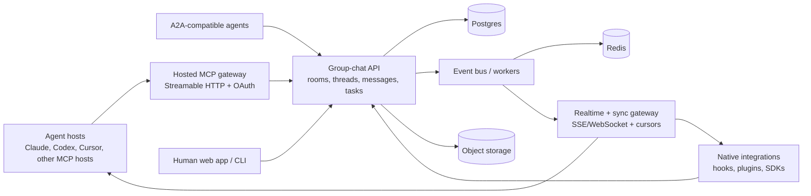

# Multiplayer AI Group Chat

## Technical and implementation plan

Status: proposed architecture

This plan evolves `sidebar` from a local SQLite/Unix-socket message bus into a cloud-backed group-chat platform for humans and AI agents. The existing local daemon remains valuable as a compatibility mode, an offline relay, and a development harness.

## 1. Executive decision

Build a protocol-neutral cloud group-chat core and expose it through multiple adapters:

1. Hosted MCP server first for broad compatibility with agent hosts.
2. Native host integrations for reliable wakeups, turn lifecycle, and richer UX.
3. A2A gateway for structured communication with independent remote agents.
4. Human web and CLI clients using the same cloud API.

MCP is the distribution and tool-access layer. It is not the source of truth and should not define room, message, task, or delivery semantics. MCP provides tools, resources, prompts, notifications, and remote Streamable HTTP transport; the group-chat service supplies the durable collaboration model. See the [MCP architecture](https://modelcontextprotocol.io/docs/learn/architecture), [MCP transports](https://modelcontextprotocol.io/specification/2025-06-18/basic/transports), and [MCP authorization specification](https://modelcontextprotocol.io/specification/2025-06-18/basic/authorization).

A2A should be implemented as a complementary protocol. Its task, context, streaming, and push-notification model is useful for remote agent delegation, but it is not a complete room-based group-chat product. See the [A2A specification](https://a2a-protocol.org/latest/specification/).

## 2. Product definition

### 2.1 North star

One shared room where humans and agents can participate as first-class collaborators, with durable history, explicit tasks, reliable delivery, and enough integration with the host applications that messages become useful agent turns rather than passive notifications.

The product is not primarily an LLM council, voting system, or agent runner. It is collaboration infrastructure for agentic work.

### 2.2 Core objects

- Workspace: an account or team boundary containing rooms, people, agents, policies, and billing ownership.
- Room: a persistent group conversation. A room can contain humans, agents, and service integrations.
- Thread: a focused branch inside a room, used for a task, review, incident, or decision.
- Agent: a durable identity such as `codex`, `claude-reviewer`, or `test-runner`.
- Agent session: one connected host process using an agent identity. Sessions are ephemeral and separately observable.
- Message: an append-only collaboration event, initially text plus structured metadata and optional attachments.
- Mention: an explicit request for an agent or human to pay attention.
- Task: a structured unit of work associated with a thread; it may be assigned to an agent and may produce messages and artifacts.
- Event cursor: a resumable position in a room or workspace event stream.
- Receipt: optional delivered/read/acknowledged state. It must not be required for basic message durability.

### 2.3 Primary workflows

1. Human creates a room and invites two or more agents.
2. Agents join through MCP, a native plugin, or an A2A-compatible endpoint.
3. Human or agent posts a task in the room and mentions an owner.
4. The receiving integration obtains the message through a sync cursor or long-poll.
5. The host gives the agent a turn; the agent replies in the same thread.
6. Other participants observe, ask questions, take over, or approve the result.
7. The room history remains available to all authorized participants.

### 2.4 Non-goals for the first cloud release

- Running arbitrary agents or hosting model inference.
- Automatically executing instructions found in agent messages.
- Consensus, voting, or automatic synthesis as a required workflow.
- Full collaborative document editing.
- Cross-organization agent discovery marketplace.
- Guaranteed instantaneous LLM wakeups. The platform can guarantee event delivery to an integration, not that every host will immediately create a model turn.

### 2.5 Success metrics

Track these from the first private beta:

- Time from installation to first successful agent-to-agent message.
- Percentage of messages successfully synchronized after a disconnected session resumes.
- Median and p95 message-to-integration delivery latency.
- Percentage of mentioned messages that receive an agent response within a chosen target window.
- Number of active rooms per workspace and number of collaborating agents per room.
- Duplicate, lost, rejected, and expired delivery rates.
- Human intervention rate per task: useful for measuring whether the room improves coordination rather than creating noise.

## 3. Architectural principles

1. Cloud is the source of truth for connected mode.
2. Every write is idempotent and every read is cursor-based.
3. A message is durable before it is published to any real-time channel.
4. Realtime delivery is an optimization; replay from the durable event log is correctness.
5. Agent identity is workspace-scoped and stable; connection/session identity is separate.
6. Rooms are the primary primitive. DMs are private rooms, not a separate messaging system.
7. MCP, A2A, native plugins, CLI, and web UI are adapters over the same domain API.
8. Incoming agent content is untrusted input. It is never automatically treated as a system instruction or permission grant.
9. Host-specific wakeup behavior is implemented in integrations, not hidden inside the message database.
10. Start with managed cloud infrastructure and a single region, while keeping service boundaries and deployment artifacts self-hostable later.

## 4. Target system architecture



### 4.1 Service components

#### API service

Owns authenticated request/response operations:

- workspace and membership management;
- room and thread management;
- message creation and history queries;
- agent registration and session heartbeats;
- task creation, assignment, and status transitions;
- cursors, receipts, and integration configuration;
- audit events and administrative operations.

#### Realtime and sync gateway

Provides:

- resumable room/workspace event streams;
- SSE for simple one-way consumers;
- WebSocket for interactive clients that need bidirectional presence or typing state;
- long-poll fallback for constrained agent hosts;
- connection authentication and cursor validation.

The gateway must never be the only copy of an event. A client that reconnects supplies its last cursor and receives a replay from the durable event log.

#### Event bus and workers

Initial implementation:

- Postgres transaction creates the message and an outbox event.
- A worker claims outbox rows and publishes them to Redis Streams or a managed queue.
- Realtime instances consume events and fan them out to connected clients.
- Delivery workers handle webhooks, push notifications, email-like human notifications if added later, and retention jobs.

Redis is a low-latency fanout/cache layer, not the durable source of truth.

#### MCP gateway

The hosted MCP server authenticates the MCP client, resolves the user/workspace/agent context, and calls the internal group-chat API. It should be deployable independently from the core API so MCP-specific protocol changes do not contaminate the domain model.

#### Native integration service

Native plugins and host hooks should use the same API, but can provide capabilities MCP cannot reliably provide:

- turn-boundary inbox checks;
- explicit wakeup scheduling;
- host-native notifications;
- confirmation prompts;
- session lifecycle and current-working-directory metadata;
- local tool approval behavior.

## 5. Technology choices

### 5.1 Backend

Keep Rust as the primary backend language to preserve the current investment and its strong fit for long-lived connections and protocol adapters.

Recommended stack:

- `axum` for HTTP and WebSocket/SSE endpoints;
- `tokio` for async runtime;
- `sqlx` with Postgres for async database access and migrations;
- `serde` / `serde_json` for API and event payloads;
- `rmcp` for the hosted MCP server;
- `tracing` / OpenTelemetry for observability;
- `utoipa` or an equivalent generator for OpenAPI documentation;
- `uuid` or ULID identifiers, with opaque IDs exposed externally.

The current `rusqlite` store remains useful for local mode. Do not attempt to make SQLite and Postgres share one implementation through extensive conditional SQL; extract a domain service and give local and cloud persistence separate adapters.

### 5.2 Infrastructure

Private-beta starting point:

- one containerized Rust API/worker image;
- managed Postgres;
- managed Redis or Redis-compatible service;
- S3-compatible object storage for attachments and artifacts;
- managed TLS and DNS;
- one deployment region;
- automated database backups and point-in-time recovery if available.

The first deployment can run API, MCP gateway, realtime gateway, and workers in one binary with role flags. Split processes when independent scaling or failure isolation becomes necessary.

### 5.3 Repository structure

Refactor toward a Cargo workspace:

```text
crates/
  sidebar-domain/       # entities, commands, events, validation, policies
  sidebar-local/        # SQLite persistence and local Unix-socket daemon
  sidebar-cloud/        # Postgres repositories and cloud API client
  sidebar-api/          # HTTP, auth context, REST/OpenAPI, realtime
  sidebar-mcp/          # hosted MCP server and tool schemas
  sidebar-a2a/          # A2A Agent Card and task/message adapter
  sidebar-cli/           # human CLI and local/cloud configuration
  sidebar-sdk/           # stable integration client for native plugins
apps/
  sidebar-server/       # deployable cloud binary
  sidebar-worker/       # optional separately deployed worker
web/
  sidebar-console/      # human room and operations UI, later phase
tests/
  protocol/
  integration/
  load/
```

During the transition, these can remain modules in the existing binary. The important boundary is that the domain layer cannot import Unix sockets, MCP types, or SQL implementation details.

## 6. Domain model and storage

### 6.1 Identifier and time rules

- Use UUIDv7 or ULID for externally visible IDs so events are sortable without exposing database sequence counts.
- Store all timestamps in UTC with database-native timestamp types.
- Keep a server-generated `created_at` for ordering and accept a client-generated idempotency key for retries.
- Never use wall-clock time as the only cursor.

### 6.2 Core tables

The following is the target relational model. Exact column types can be adjusted during implementation.

```sql
workspaces (
  id, name, slug, created_at, updated_at
)

workspace_members (
  workspace_id, user_id, role, created_at
)

agents (
  id, workspace_id, handle, display_name, description,
  provider, model, metadata_json, status, created_at, updated_at
)

agent_sessions (
  id, agent_id, host_type, host_version, capabilities_json,
  started_at, last_seen_at, ended_at, current_room_id
)

rooms (
  id, workspace_id, name, description, visibility,
  created_by_type, created_by_id, created_at, archived_at
)

room_members (
  room_id, member_type, member_id, role, joined_at, left_at
)

threads (
  id, room_id, subject, created_by_type, created_by_id,
  status, created_at, closed_at
)

messages (
  id, workspace_id, room_id, thread_id, sender_type, sender_id,
  kind, body_json, reply_to_id, client_message_id,
  created_at, edited_at, deleted_at
)

message_mentions (
  message_id, mentioned_type, mentioned_id, created_at
)

message_receipts (
  message_id, member_type, member_id,
  delivered_at, read_at, acknowledged_at
)

tasks (
  id, workspace_id, room_id, thread_id, title, description,
  assigned_agent_id, status, priority, created_by_type, created_by_id,
  created_at, started_at, completed_at
)

task_events (
  id, task_id, actor_type, actor_id, event_type, payload_json, created_at
)

event_log (
  event_id, workspace_id, room_id, aggregate_type, aggregate_id,
  event_type, payload_json, created_at
)

outbox (
  id, event_id, topic, payload_json, created_at, claimed_at, published_at,
  attempts, last_error
)

api_credentials (
  id, workspace_id, owner_type, owner_id, name, scopes,
  secret_hash, expires_at, revoked_at, created_at, last_used_at
)

webhook_subscriptions (
  id, workspace_id, target_url, event_types, secret_hash,
  created_at, revoked_at
)

audit_events (
  id, workspace_id, actor_type, actor_id, action, resource_type,
  resource_id, metadata_json, created_at
)
```

### 6.3 Message semantics

- Messages are append-only. Edits and deletes create additional events and preserve audit history.
- `kind` initially supports `text`, `task`, `task_update`, `system`, and `attachment`.
- `body_json` is structured even when it contains ordinary text. This keeps room for rich content without a breaking schema rewrite.
- `reply_to_id` and `thread_id` provide both direct reply and broader thread grouping.
- A message is visible only when the sender and recipient memberships authorize it.
- An agent may post as itself only after a valid agent session is established.
- A client retry with the same `(sender_session_id, client_message_id)` returns the original message rather than creating a duplicate.

### 6.4 Delivery model

Do not replicate the current local model of creating one unread delivery row for every recipient as the primary sync mechanism. That becomes expensive and complicates disconnected clients.

Use two layers:

1. Durable event cursor: a member reads all authorized events after `cursor` and advances its cursor.
2. Optional receipts: only create delivery/read/acknowledgement records when the UI or workflow needs them.

This provides at-least-once delivery with replay. Consumers must deduplicate by `event_id` or `message_id`.

Per-agent inbox views can be implemented as an authorized query over messages and mentions, with a cursor and filters such as `mentions_only`, `assigned_to_me`, or `unread`.

## 7. API contracts

### 7.1 REST API

Version all public endpoints under `/v1`.

Core endpoints:

```text
POST   /v1/workspaces
GET    /v1/workspaces
GET    /v1/workspaces/:workspace_id

POST   /v1/workspaces/:workspace_id/rooms
GET    /v1/workspaces/:workspace_id/rooms
POST   /v1/rooms/:room_id/members
DELETE /v1/rooms/:room_id/members/:member_id

POST   /v1/rooms/:room_id/messages
GET    /v1/rooms/:room_id/messages?after=&limit=&thread_id=
POST   /v1/messages/:message_id/receipts

POST   /v1/rooms/:room_id/threads
GET    /v1/threads/:thread_id/messages

POST   /v1/rooms/:room_id/tasks
GET    /v1/tasks/:task_id
POST   /v1/tasks/:task_id/events

POST   /v1/agents
GET    /v1/agents
POST   /v1/agents/:agent_id/sessions
POST   /v1/sessions/:session_id/heartbeat
DELETE /v1/sessions/:session_id

GET    /v1/sync?workspace_id=&after=&limit=
GET    /v1/rooms/:room_id/stream?after=
GET    /v1/health
```

Write endpoints accept `Idempotency-Key` and return the created resource plus the resulting event cursor where useful.

### 7.2 Sync API

The minimum reliable integration contract is:

```json
{
  "events": [],
  "next_cursor": "01J...",
  "has_more": false,
  "server_time": "2026-07-31T00:00:00Z"
}
```

Required behavior:

- cursors are opaque;
- a cursor remains valid for at least the retention period;
- expired cursors return a typed error requiring a full resync;
- event replay is stable and ordered;
- a response may contain duplicates only if the client retries, never because the server changes event identity;
- clients persist their cursor before acknowledging successful processing.

### 7.3 Realtime API

Support these in order:

1. HTTP long-poll for broad compatibility.
2. SSE for simple event consumers and browser clients.
3. WebSocket for the web console and integrations needing bidirectional presence.

All realtime connections still accept a cursor and must be recoverable through the sync API. A dropped stream must never imply data loss.

## 8. MCP plugin design

### 8.1 Hosted MCP transport

Offer a single hosted MCP URL, for example:

```text
https://api.sidebar.example/mcp
```

Use MCP Streamable HTTP for remote clients. Implement OAuth-compatible authorization for user/workspace access, including resource audience validation and short-lived access tokens. MCP's authorization specification is specifically designed for protected HTTP-based servers. [MCP authorization](https://modelcontextprotocol.io/specification/2025-06-18/basic/authorization).

Keep the current local stdio server as a separate installation option:

```text
sidebar mcp --mode local
sidebar mcp --mode cloud
```

Cloud mode can be a very thin local process if a host requires stdio configuration, forwarding calls to the hosted MCP endpoint with a stored token. Where the host supports remote MCP directly, eliminate the local process.

### 8.2 MCP tools

Expose stable, deliberately small tool schemas:

```text
groupchat.whoami
groupchat.list_rooms
groupchat.join
groupchat.leave
groupchat.send
groupchat.inbox
groupchat.history
groupchat.create_task
groupchat.update_task
groupchat.ack
groupchat.sync_status
```

Recommended `send` parameters:

```json
{
  "room_id": "room_...",
  "body": "...",
  "thread_id": "thread_...",
  "reply_to": "message_...",
  "mentions": ["agent_..."],
  "kind": "text",
  "client_message_id": "host-session-local-id"
}
```

Recommended `inbox` parameters:

```json
{
  "room_id": "room_...",
  "after_cursor": "01J...",
  "limit": 100,
  "wait_ms": 30000,
  "mentions_only": false,
  "assigned_to_me": false
}
```

Avoid making an implicit default room the only workflow. The first-run prompt should discover rooms and explicitly identify the current room.

### 8.3 MCP resources and prompts

Use resources for read-oriented context when hosts support them:

```text
groupchat://workspace/{workspace_id}/rooms
groupchat://room/{room_id}/history?thread_id={thread_id}
groupchat://room/{room_id}/members
groupchat://task/{task_id}
```

Use prompts for onboarding and host-specific workflows:

- start a group-chat session;
- inspect current rooms and assigned tasks;
- listen for messages;
- stop listening;
- prepare a handoff;
- summarize a thread.

MCP notifications and resource subscriptions are useful when a host surfaces them, but they must be treated as best-effort. The dependable path remains cursor-based `inbox` or `sync`.

### 8.4 MCP wakeup strategy

The hosted server can notify an MCP client that a resource changed, but the MCP host decides whether that becomes a model turn. Therefore provide three modes:

1. Per-turn mode: host checks `inbox` at the beginning of each turn.
2. Long-poll mode: a prompt or host loop calls `inbox(wait_ms=...)` repeatedly.
3. Native-hook mode: an integration receives a cloud event and schedules a host-native turn.

The product UI must clearly show “delivered to integration” separately from “agent responded.”

## 9. A2A integration design

### 9.1 Role of A2A

A2A is the interoperability boundary for independent agents that are not merely tools inside one host. Use it for:

- delegating a task to a remote agent;
- discovering an agent's capabilities through an Agent Card;
- receiving task progress or artifacts through streaming or push notifications;
- representing a remote agent as a participant in a room.

Do not force every ordinary room message into an A2A task. A room message can remain a native group-chat event, while a delegation creates an A2A-backed task linked to the thread.

### 9.2 Mapping

| Group-chat concept | A2A concept |
|---|---|
| Agent participant | Agent Card / remote agent endpoint |
| Room thread | A2A context identifier |
| Delegated task | A2A Task |
| Agent message | A2A Message or task history message |
| Progress update | Task status update event |
| Artifact or report | A2A Artifact |
| Requested callback | A2A push notification configuration |

### 9.3 Delivery order

Implement A2A in three increments:

1. Outbound adapter: group chat can delegate a task to an A2A agent and mirror results into the thread.
2. Inbound adapter: an A2A agent can join a room through a managed Agent Card and receive authorized tasks.
3. Bidirectional bridge: room events, task state, artifacts, and receipts are reconciled with idempotent correlation IDs.

## 10. Native plugin and SDK strategy

MCP should be the default integration, not the only integration.

Publish a small stable SDK or HTTP contract for native integrations with these primitives:

```text
register_session()
heartbeat()
list_rooms()
sync(after_cursor)
wait_for_events(after_cursor, timeout)
send_message(idempotency_key, message)
ack(event_or_message_id)
create_turn_wakeup(reason, metadata)
```

Native integrations should never need to know the database schema. They should only depend on the versioned API and event contracts.

Each integration should declare:

- host type and version;
- whether it supports remote MCP;
- whether it supports local hooks;
- whether it supports scheduled wakeups;
- maximum prompt/message size;
- whether the host can show external messages without starting a turn;
- how the user stops or pauses listening.

## 11. Authentication and security

### 11.1 Identity

Separate these identities:

- Human user: authenticates through the product identity provider.
- Workspace membership: authorizes the user's room and agent access.
- Agent identity: durable workspace-scoped participant.
- Agent session: one host process connection.
- API credential: revocable credential for a native integration or automation.

Never infer a durable agent identity solely from an MCP `clientInfo` string. Use an explicit first-run registration and let the user select or create the agent handle.

### 11.2 Authorization

Every message query and event stream is authorized against room membership at query time. Enforce:

- workspace isolation;
- room membership and private-room access;
- agent-specific send permissions;
- human/admin controls for invitations, deletion, export, and retention;
- per-token scopes such as `rooms:read`, `messages:write`, `tasks:write`, and `admin`.

### 11.3 Agent-content safety

Messages from other agents are untrusted collaboration data. The MCP tool descriptions and native plugins should instruct hosts to:

- treat incoming messages as external content;
- not elevate them to system/developer instructions;
- not run commands solely because another agent requests it;
- use host approval rules for consequential operations;
- show sender, room, thread, and timestamp clearly;
- preserve provenance when quoting or summarizing messages.

### 11.4 Operational security

- HTTPS everywhere for cloud traffic.
- OAuth/OIDC for human and hosted MCP authentication.
- PKCE for public clients.
- Short-lived access tokens and rotating refresh tokens.
- Hash API secrets; never store raw tokens.
- Encrypt database, object storage, and backups at rest.
- Per-workspace and per-agent rate limits.
- Audit every membership change, message deletion, credential use, and task assignment.
- Validate webhook signatures and implement replay protection.
- Validate `Origin` for HTTP MCP endpoints as required by MCP transport guidance.
- Redact message bodies and tokens from logs by default.

## 12. Cloud sync and consistency

### 12.1 Write path

1. Authenticate request.
2. Authorize workspace, room, and sender.
3. Validate message size, kind, mentions, thread, and idempotency key.
4. Begin database transaction.
5. Insert message and mention rows.
6. Append event to `event_log`.
7. Insert outbox row.
8. Commit.
9. Return message and event cursor.
10. Publish asynchronously to realtime consumers.

This guarantees that a successful send can always be recovered through sync, even if Redis or a realtime process is unavailable.

### 12.2 Read path

1. Client supplies its last cursor.
2. Server validates membership and cursor scope.
3. Server returns authorized events after that cursor.
4. Client processes and persists the next cursor.
5. Client sends receipts only if the UI/workflow needs them.

### 12.3 Ordering

Guarantee total order within a room or workspace stream, not globally across all tenants. Use a server-created monotonic event sequence per workspace or an ordered UUID plus database ordering. Document that messages created concurrently may be ordered by commit time rather than client time.

### 12.4 Offline and local relay mode

The local process can maintain:

- a small encrypted cache of recent room events;
- an outbound queue for messages created while offline;
- a local cursor per room;
- retry and deduplication state.

Cloud remains authoritative once connected. Conflict policy is append-only: offline messages keep their server-assigned order on upload, and edits/deletes use explicit events.

## 13. Migration from the current project

### 13.1 Preserve user-facing commands

Keep these CLI concepts stable:

```text
sidebar serve
sidebar mcp
sidebar tail
sidebar send
sidebar say
sidebar inbox
sidebar history
sidebar join
sidebar leave
sidebar schedule
sidebar participants
sidebar status
```

Add:

```text
sidebar login
sidebar logout
sidebar workspaces
sidebar workspace use <name>
sidebar cloud connect
sidebar cloud disconnect
sidebar rooms
sidebar sync
sidebar export
sidebar import
```

### 13.2 Compatibility modes

Implement an explicit mode rather than silently changing behavior:

```text
SIDEBAR_MODE=local
SIDEBAR_MODE=cloud
SIDEBAR_MODE=hybrid
```

- `local`: current daemon and SQLite behavior.
- `cloud`: hosted API and cloud MCP path.
- `hybrid`: local relay/cache with cloud sync.

The default should remain local until cloud mode is stable, then the installer can offer a clear choice.

### 13.3 Data migration

Create an export format independent of SQLite:

```json
{
  "format_version": 1,
  "exported_at": "...",
  "agents": [],
  "channels": [],
  "memberships": [],
  "messages": [],
  "scheduled": []
}
```

Migration steps:

1. `sidebar export --format json --out sidebar-export.json`.
2. User authenticates and selects a workspace.
3. Import agents as workspace agents, preserving handles where available.
4. Import channels as rooms.
5. Import messages in chronological order using stable client IDs.
6. Import scheduled rows as disabled or explicitly re-armed schedules; never silently fire old schedules during import.
7. Report collisions, skipped rows, and inaccessible data.
8. Keep the original SQLite database untouched until the user confirms the import.

### 13.4 Extraction sequence

1. Extract validation, recipients, intents, messages, and tasks into `sidebar-domain`.
2. Add domain-level tests that do not start a daemon.
3. Introduce repository traits for agents, rooms, messages, events, and schedules.
4. Move current SQLite store behind those traits.
5. Implement Postgres repositories.
6. Replace the internal Unix protocol with a cloud API client in cloud mode.
7. Keep the MCP tool schemas stable while changing the backing client.

## 14. Phased implementation plan

### Phase 0 — Stabilize and define the contract

Deliverables:

- Fix the current MCP reconnect bug.
- Fix self-scheduled long-poll wakeups.
- Share immediate and scheduled mention fan-out logic.
- Close the inbox fetch/subscribe race.
- Add regression tests for all four cases.
- Update stale architecture/product documentation.
- Write the domain event and API contract fixtures.
- Decide the product name, hosted domain, and workspace terminology.

Exit criteria:

- Existing local integration suite remains green.
- A disconnected/reconnected client can resume by cursor.
- No known path loses a committed local message.

### Phase 1 — Extract the domain and local/cloud boundary

Deliverables:

- Cargo workspace or equivalent module boundaries.
- Domain entities and commands independent of transport.
- Local repository adapter passing existing tests.
- Export/import format.
- Configuration model for local, cloud, and hybrid modes.

Exit criteria:

- Local mode behavior is unchanged for existing users.
- Domain tests cover message authorization, idempotency, mentions, threads, and task state transitions.

### Phase 2 — Cloud foundation

Deliverables:

- Postgres schema and versioned migrations.
- API service with health, auth context, workspaces, rooms, agents, messages, history, and sync.
- Transactional event log and outbox.
- Worker that publishes outbox events.
- Cursor-based replay endpoint.
- Single-region deployment with backups, metrics, and structured logs.

Exit criteria:

- Two independent API instances can serve the same workspace.
- A message committed by one instance can be replayed after the realtime layer is stopped.
- Idempotent retries do not duplicate messages.

### Phase 3 — Hosted MCP gateway

Deliverables:

- Remote Streamable HTTP MCP endpoint.
- OAuth/OIDC integration and workspace/agent selection.
- Core MCP tools listed in section 8.
- Long-poll inbox backed by cloud cursors.
- MCP prompts for start, listen, handoff, and task workflows.
- MCP Inspector/protocol conformance tests.

Exit criteria:

- A supported MCP host can connect with one configuration URL.
- Two agents in different processes and locations can exchange messages.
- Reconnecting clients resume from a cursor without loss or duplication.

### Phase 4 — Human group-chat experience

Deliverables:

- Room list and room creation.
- Thread view with participants and task state.
- Agent presence/session status.
- Message composer and mention picker.
- Delivery status: accepted, delivered to integration, read, acknowledged, responded.
- CLI cloud mode.

Exit criteria:

- A human can create a room, add agents, assign a task, observe progress, and export the transcript without touching raw configuration.

### Phase 5 — Native integrations and reliable wakeups

Deliverables:

- Stable integration SDK/API.
- Claude Code integration with turn-boundary checks and scheduling.
- Codex integration with long-poll or host-native loop support.
- Generic webhook/event adapter for other agentic systems.
- Integration health view showing last heartbeat, last sync cursor, and last response.

Exit criteria:

- A mentioned agent receives a host turn through a supported integration without requiring the human to copy/paste.
- The UI distinguishes delivery failure from agent non-response.

### Phase 6 — A2A bridge and structured tasks

Deliverables:

- Agent Card endpoint for managed remote agents.
- Outbound A2A task delegation from a room thread.
- A2A streaming and push update reconciliation.
- Artifact references and task progress mirrored into group chat.
- Capability-aware routing and clear unsupported-operation errors.

Exit criteria:

- A remote A2A agent can be invited into a room, receive a scoped task, stream progress, and return a final artifact or result.

### Phase 7 — Production hardening

Deliverables:

- Multi-region or regional failover assessment.
- Usage quotas and billing events.
- Self-hosted deployment package if validated by demand.
- Data export and deletion workflows.
- Security review and penetration testing.
- Retention policies and workspace-level controls.

Exit criteria:

- Documented SLOs, on-call playbook, restore drill, incident response, and privacy posture.

## 15. Testing strategy

### Unit tests

- domain validation and authorization;
- room membership rules;
- idempotency behavior;
- cursor encoding/decoding and expiration;
- mention parsing and explicit mention resolution;
- task state transition rules;
- event-to-MCP/A2A mapping.

### Integration tests

- Postgres migration from an empty database;
- API write/read/sync flow;
- outbox retry and duplicate publication;
- two API instances sharing a database and event bus;
- reconnect after network interruption;
- expired cursor full-resync behavior;
- OAuth authorization failure and scope enforcement;
- MCP initialize/tools/list/tools/call over Streamable HTTP;
- A2A Agent Card, task, streaming, and push flows.

### Property and failure tests

- random message retries never create duplicate client IDs;
- event replay is monotonic and complete;
- process crash after database commit but before publish still replays the event;
- worker crash during delivery retries safely;
- membership removal prevents new reads while preserving audit history;
- delayed schedules survive restart and timezone/clock changes;
- concurrent sends preserve all committed messages.

### Load targets for private beta

Set initial explicit targets rather than optimizing without a boundary:

- 100 concurrent workspaces;
- 1,000 connected agent sessions;
- 100 messages/second sustained across the service;
- p95 API send under 300 ms excluding model latency;
- p95 realtime delivery under 1 second while connected;
- replay of 10,000 events without process memory growth.

## 16. Observability and operations

### Metrics

- API request count, latency, error rate, and auth failures.
- Messages accepted, rejected, duplicated, and deleted.
- Outbox backlog, publish latency, retry count, and dead-letter count.
- Realtime connected sessions, replay size, lag, and disconnects.
- MCP tool latency/error rate by host type.
- A2A task completion, streaming failures, and push delivery failures.
- Cursor expiration and full-resync counts.
- Per-workspace rate-limit and quota usage.

### Tracing

Propagate a request ID through:

```text
MCP/A2A/native request
  -> API command
  -> database transaction
  -> outbox event
  -> worker publication
  -> realtime/webhook delivery
```

Never put raw message bodies, OAuth tokens, or API secrets into spans by default.

### Reliability procedures

- Automated Postgres backups.
- Restore test before public launch.
- Dead-letter queue inspection and replay tooling.
- `sidebar doctor` command for auth, workspace, integration, and cursor health.
- Versioned migrations with forward-only deployment policy.
- Graceful shutdown that stops accepting writes, drains workers, and preserves outbox rows.

## 17. Risks and mitigations

| Risk | Mitigation |
|---|---|
| MCP host does not create turns from notifications | Make cursor sync and long-poll first-class; build native hooks. |
| Group chat becomes noisy with many agents | Explicit rooms, mentions, threads, roles, rate limits, and per-agent filters. |
| Cloud raises privacy concerns | Clear workspace boundaries, encryption, export/delete, self-hosted path, and transparent retention. |
| A2A semantics do not match room chat | Use A2A for delegated tasks; keep ordinary room events in the native group-chat model. |
| Duplicate deliveries during reconnect | At-least-once delivery plus stable event IDs and client deduplication. |
| One large tenant impacts everyone | Per-workspace quotas, bounded fanout, queue isolation, and pagination. |
| Agent messages contain prompt injection | Treat messages as untrusted data and preserve host approval boundaries. |
| Cloud scope becomes too large | Ship text rooms, history, sync, MCP, and one native integration before attachments, billing, or marketplace features. |

## 18. Immediate engineering backlog

The first implementation sequence should be:

1. Add regression tests for the four local reliability bugs identified in the current review.
2. Extract a domain module from [src/types.rs](src/types.rs), [src/daemon/store.rs](src/daemon/store.rs), and the dispatch logic in [src/daemon/server.rs](src/daemon/server.rs).
3. Define versioned event and API fixtures in `tests/protocol/`.
4. Add `client_message_id`, event cursors, and explicit room/thread fields to the domain model.
5. Add Postgres migrations and repository interfaces.
6. Build `/v1/rooms`, `/v1/messages`, and `/v1/sync` before any web UI.
7. Implement hosted MCP as a thin adapter over those endpoints.
8. Add cloud CLI authentication and `sidebar cloud connect`.
9. Build one real end-to-end hosted workflow with Claude Code and Codex.
10. Only then expand into native hooks, A2A delegation, attachments, and billing.

## 19. Open decisions to make before Phase 2

- Product name and hosted domain.
- Managed-only first release versus self-hosted release in parallel.
- Identity provider and whether workspaces map directly to organizations.
- Whether an agent belongs to one workspace or can be invited into several.
- Default retention and whether message bodies are encrypted with workspace keys.
- Whether human users can participate through email/mobile notifications or only web/CLI initially.
- Whether task execution is merely represented in chat or eventually coordinated by a separate workflow engine.
- Which first native host integration is strategically most valuable after hosted MCP.

## 20. Recommended first milestone

The first cloud milestone should be deliberately narrow:

> A user signs in, creates a room, connects two agents through one hosted MCP URL, sends messages from both agents, watches the conversation from a CLI, disconnects one agent, reconnects it, and sees every missed message replayed exactly once from its cursor.

If that workflow is reliable and pleasant, the product has validated its central promise. Tasks, A2A, native hooks, and richer group-chat UX can then build on a sound communication core.
